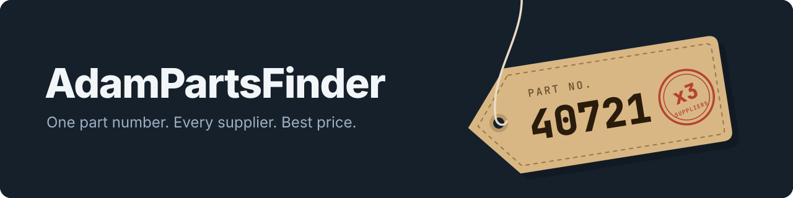

<p align="center">
  
</p>

<h1 align="center">AdamPartsFinder</h1>

<p align="center">
  <a href="LICENSE"></a>
</p>

---

Proof of concept of a price comparison web app for parts from several suppliers. Written in R/Shiny, runs with Docker Compose.

## Features

- Search up to three part numbers at once with a minimum quantity; for each, it shows the cheapest supplier offer with enough stock.
- Upload a CSV per supplier (A, B, C); it is saved under `data/` inside the container and reloaded on restart (`docker compose down` discards it).
- Uploads up to 200 MB.
- Browse the loaded supplier tables in the UI.
- Sample supplier CSVs ship in `data/`.

## Quick start

You need Docker. Clone the repo, then build and start the app:

```bash
docker compose up -d --build
```

Open http://localhost (the compose maps port 80 to the app's 3838). The Docker Hub image `acsdesk/adampartsfinder` has no versioned tag, so the compose file builds from the repo.

## License

[GPL-3.0-or-later](LICENSE)
